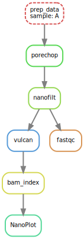

# ngs_bench
### Pre-requisite
```bash
conda activate snakemake 
```
make sure your snakemake environment includes the followings:
```bash
conda install -c bioconda graphviz nanoplot nanofilt
```

### Directory Structure

```
├── dag.svg
├── data
├── LICENSE
├── README.md
├── report
└── workflow
    └── Snakefile
```

### Snakemake
To execute:
```bash
snakemake -c8 report/vulcan_PCNF_A_NanoStats.txt report/PCNF_A_fastqc.zip
```

1. prepare sample data
   copy fastq file (temporary hardcoded to kai_lambda/fastqgz_files.fastq.gz) to the snakemake data directory

2. porechop from sample data

3. fastq from porchop output

4. NanoFilt 

5. NanoPlot

Todos: some errors generated due to output file missing, seems like the output rules problem.


### DAG Flow
To generate DAG:
```bash
snakemake --dag -c8 report/vulcan_PCNF_A_NanoStats.txt report/PCNF_A_fastqc.zip | dot -Tsvg > dag.svg
 ```
<p align="left"></p>


