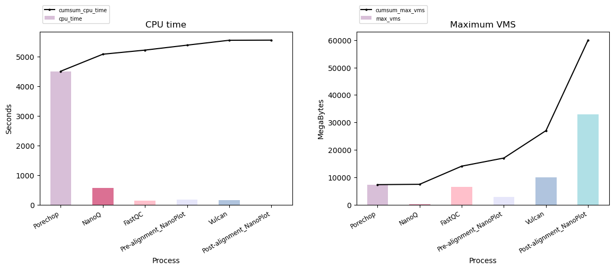
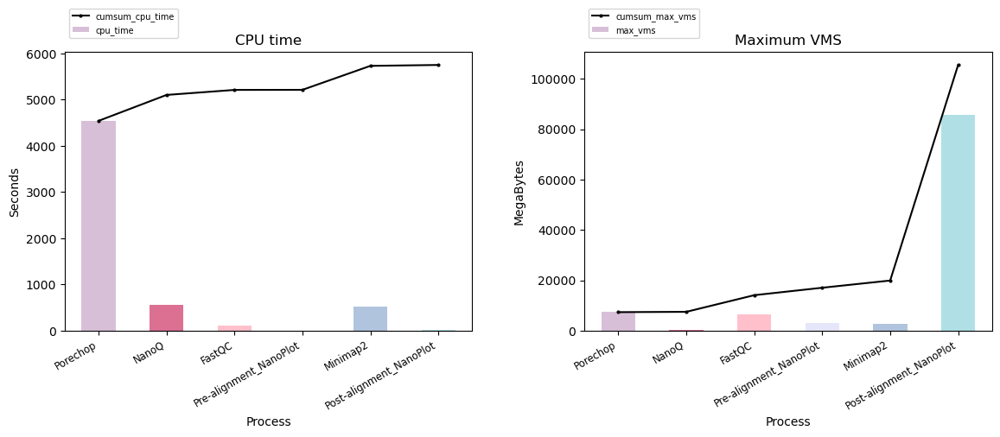

# FABLE

<p align="center">
  

**FABLE is an automated and reproducible snakemake workflow tailored to Oxford Nanopore Sequencing reads. After easy installation with conda, it is straightforward to run on local computers, filtering out and trimming low-quality reads to generate high-quality alignments against a reference genome**

### Git clone the project from Github
```bash
git clone https://github.com/kaiseriskera/FABLE.git
cd FABLE
```
### Setup the conda environment
First, you need to install a Conda-based Python3 distribution. The recommended choice is [Mambaforge](https://github.com/conda-forge/miniforge#mambaforge) which not only provides the required Python and Conda commands, but also includes Mamba, an extremely fast and robust replacement for the Conda package manager which is highly recommended.
In order to run the pipeline, make sure all the necessary tools are installed in the conda environment. The environment yaml file can be found in env/environment.yml.
```bash
conda env create -f ./env/environment.yml
conda activate fable
```
### Directory Structure

```
.
├── config
│   ├── config.yaml
├── dag_mm2.svg
├── dag_vulcan.svg
├── env
│   └── environment.yml
├── LICENSE
├── README.md
├── workdir_{sample name}_mm2
│   ├── benchmarks
│   ├── data
│   └── report
├── workdir_{sample name}_vulcan
│   ├── benchmarks
│   ├── data
│   └── report
└── workflow
    ├── scripts
    │   ├── mm2_plot_benchmark.py
    │   └── vulcan_plot_benchmark.py
    └── Snakefile

```

### Snakemake
To execute with vulcan path
```bash
snakemake --config rule_opt="vulcan" -c8 
```
To execute with minimap2 path
```bash
snakemake --config rule_opt="mm2" -c8 
```

### DAG Flow
To generate DAGs:
```bash
snakemake --config rule_opt="vulcan" -c8 --dag | dot -Tsvg > dag_vulcan.svg
snakemake --config rule_opt="mm2" -c8 --dag | dot -Tsvg > dag_mm2.svg 
 ```    
<br/>
<br/>
  
&nbsp; &nbsp; &nbsp; &nbsp; &nbsp; &nbsp; &nbsp; &nbsp; &nbsp; &nbsp; &nbsp; &nbsp; FABLE_minimap2’s workflow &nbsp; &nbsp; &nbsp; &nbsp; &nbsp; &nbsp; &nbsp; &nbsp; &nbsp; &nbsp; &nbsp; &nbsp; &nbsp; &nbsp; &nbsp; &nbsp; &nbsp; &nbsp; &nbsp; &nbsp; &nbsp; &nbsp; &nbsp; &nbsp; &nbsp; &nbsp; &nbsp; &nbsp; &nbsp; &nbsp; &nbsp; &nbsp; &nbsp; &nbsp; &nbsp; &nbsp; &nbsp; &nbsp; &nbsp; FABLE_Vulcan’s workflow

<p align="center">
  
</p>

<br/>
<br/>

<p align="center">
    Overview of CPU time and memory usage by core software tools in FABLE_Vulcan
</p>
<p align="center">
  

<br/>
<br/>
<p align="center">
    Overview of CPU time and memory usage by core software tools in FABLE_minimap2
</p>
<p align="center">
  
</p>

## FABLE's workflow

PoreChop and NanoQ are performed on input fastq files, followed by FastQC and NanoPlot for QC analysis and visualisation. Next, alignment results achieved either by Vulcan or Minimap2 can be studied from reports generated. 

* PRE-ALIGNMENT:
    1. PoreChop
      - removes adapters from ONT's reads and merges multiple fastq files if directory is provided as input
    2. NanoQ
      - filters reads according to Phred quality (minimum quality threshold can be specified in config.yaml file)
      - default parameters filters out reads with quality score below 10 
    3. FastQC and Pre-alignment NanoPlot
      - done in parallel
      - provides QC reports for both pre-aligned and aligned data
 
* ALIGNMENT:
    1. Vulcan
      - leverages minimap2 to identify poorly aligned reads and performs realignment with the more accurate but computationally-expensive NGMLR
      - reference genome and query fastq file fed to input; outputs bam file 
    2. Minimap2
      - map long reads against reference genome
      - outputs sam file that is converted to bam file using samtools

* POST-ALIGNMENT:
    1. Post-alignment NanoPlot
      - provides detailed statistics and interactive graphs 
      - can be compared to NanoPlot report for pre-aligned data
    2. Samtools stats 
      - produce easily-readable text file with concise alignment statistics e.g. alignment mismatch rates
    4. Snakemake benchmark reports
      - generates CPU time and memory usage of each core software tool in FABLE_Vulcan and FABLE_minimap2 as bar plots
      - allows comparison of total CPU time and total memory usage of FABLE_Vulcan and FABLE_minimap2 
    5. Alignment visualisation in IGV
      - BEDTools and bedGraphToBigWig are used to generate bigWig file for displaying graph of read coverage on IGV
      - BAM files can also be loaded on IGV which depicts individual reads
    
