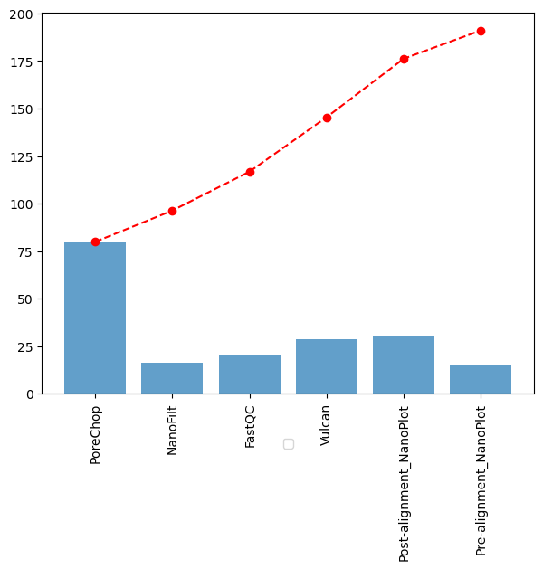
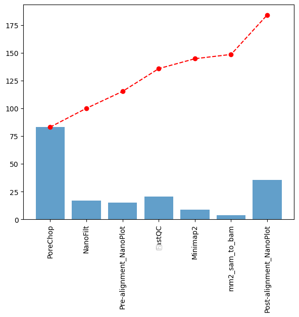

# FABLE 

<p align="center">
  

**FABLE is an automated and reproducible snakemake workflow tailored to Oxford Nanopore Sequencing reads. After easy installation with conda, it is straightforward to run on local computers, filtering out and trimming low-quality reads to generate high-quality alignments against a reference genome**

### Git clone the project from Github
```bash
git clone https://github.com/kaiseriskera/FABLE.git
cd FABLE
```
### Setup the conda environment
In order to run the pipeline, make sure all the necessary tools are installed in the conda environment. The environment yaml file can be found in env/environment.yml.
```bash
conda env create -f ./env/environment.yml
conda activate fable
```
### Directory Structure

```
.
├── config
│   ├── config.yaml
├── dag_mm2.svg
├── dag_vulcan.svg
├── env
│   └── environment.yml
├── LICENSE
├── README.md
├── workdir_mm2
│   ├── benchmarks
│   ├── data
│   └── report
├── workdir_vulcan
│   ├── benchmarks
│   ├── data
│   └── report
└── workflow
    ├── scripts
    │   └── plot_benchmark.py
    └── Snakefile

```

### Snakemake
To execute with vulcan path
```bash
snakemake --config rule_opt="vulcan" -c8 
```
To execute with minimap2 path
```bash
snakemake --config rule_opt="mm2" -c8 
```

### DAG Flow
To generate DAGs:
```bash
snakemake --config rule_opt="mm2" -c8 --dag | dot -Tsvg > dag_mm2.svg 
snakemake --config rule_opt="vulcan" -c8 --dag | dot -Tsvg > dag_vulcan.svg
 ```    
<p align="left">
  
  
</p>

<p align="left">
  
  
</p>

## FABLE's workflow

PoreChop and NanoQ are performed on input fastq files, followed by FastQC and NanoPlot for QC analysis and visualisation. Next, alignment results achieved either by Vulcan or Minimap2 can be studied from reports generated. 

* PRE-ALIGNMENT:
    1. PoreChop
      - removes adapters from ONT's reads and merges multiple fastq files if directory is provided as input
    2. NanoQ
      - filters reads depending on their quality + option for headcrop to trim nucleotides from start of read
      - default parameters filters out reads with quality score below 10 and trims the first 10 nucleotides from start of read
    3. FastQC and Pre-alignment NanoPlot
      - done in parallel
      - provides QC reports for trimmed and filtered data
 
* ALIGNMENT:
    1. Vulcan
      - leverages minimap2 to identify poorly aligned reads and performs realignment with the more accurate but computationally-expensive NGMLR
      - reference genome and query fastq file fed to input; outputs bam file 
    2. Minimap2
      - map long reads against reference genome
      - outputs sam file that is converted to bam file using samtools

* POST-ALIGNMENT:
    1. Post-alignment NanoPlot
      - visualises aligned data for comparison against unaligned data
    2. Generation of Samstats and benchmark reports
      - allows comparison between Vulcan and minimap2
    
